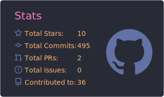
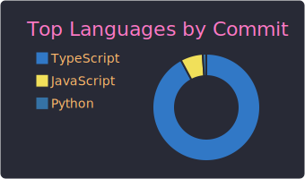

  

<h1 align="left">Hi, I'm Daksh Yadav 👋</h1>

Full-stack developer from India. Builder by choice, breaker by habit.

<h2 align="left">About Me</h2>

  Hey! I'm a self-taught full-stack developer who got here mostly by breaking things and figuring out why. I like to build and ship — not just tinker endlessly in draft mode.  
  If there's an idea, I'd rather get it out into the world and iterate than wait for it to be perfect. I've shipped multiple projects with real users, and I'm always looking for the next thing to build.  
  Fast learner, self-reliant, and I genuinely enjoy the chaos of figuring things out on my own.  
  FAFO is basically my development philosophy.

<h2 align="left">Tech Stack</h2>

<h3 align="left">Languages</h3>

  
  
  
  
  
  
  
  
  
  
  

<h3 align="left">Frontend</h3>

  
  
  
  
  
  
  
  
  

<h3 align="left">Backend</h3>

  
  
  
  
  
  
  
  
  

<h3 align="left">Databases</h3>

  
  
  

<h3 align="left">Cloud & Tools</h3>

  
  
  
  
  
  
  
  
  

 

<picture>
  <source media="(prefers-color-scheme: dark)" srcset="https://raw.githubusercontent.com/0dux/0dux/output/github-contribution-grid-snake-dark.svg" />
  <source media="(prefers-color-scheme: light)" srcset="https://raw.githubusercontent.com/0dux/0dux/output/github-contribution-grid-snake.svg" />
  
</picture>

 

  
  

  

 
<h3 align="center">Socials</h3>

  
  
  

